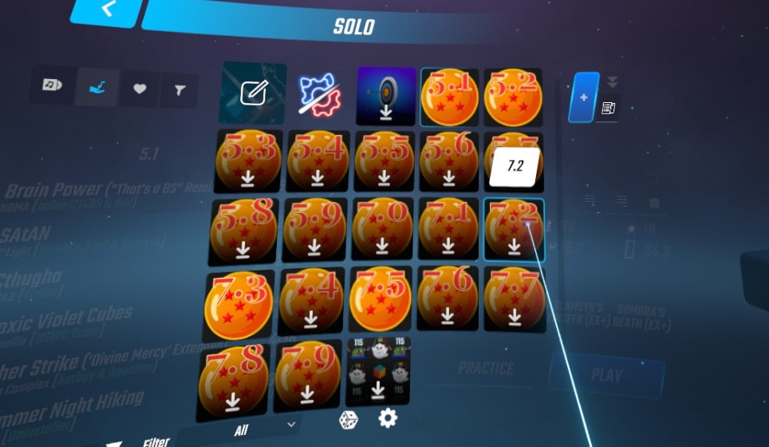

This is a quick and dirty helper script to build playlists for Beat Saber using Scoresaber ranked tracks at a certain difficulty level. After you import your playlist into Beat Saber, you can use the [PlaylistManager](https://github.com/rithik-b/PlaylistManager/blob/master/Guides/GettingStarted.md) to download all of the tracks within Beat Saber.

> To load playlists, store all playlists in the "Playlists" folder in your Beat Saber install. You may also create folders inside the Playlists folder to further organize your playlists. Supported formats are .json, .bplist and .blist Cover images go into the "Playlists\CoverImages" folder and the supported formats are .jpg and .png

TODO: If you're using a stand-alone platform like Oculus Quest, there is also a `--download` flag for downloading the maps. This would allow you to simply sideload entire playlists of songs all at once.

If you've never used custom maps in Beat Saber before, see the [bsmg wiki](https://bsmg.wiki/pc-modding.html#in-game-downloader).

# installing
install dependencies in a virtual environment
```
python3 -m venv .venv
source .venv/bin/activate.sh
pip install -r requirements.txt
```
# configure
Set the path in `run.py`, otherwiwe you'll just need to copy the Playlists folder over to your beat saber installation.

# running
TODO: detailed instructions
`python3 run.py --stars 7.3`

# notes
- scoresaber api doccumentation:
  https://docs.scoresaber.com/
- beatsaver api doccumentation:
  https://api.beatsaver.com/docs/index.html?url=./swagger.json

